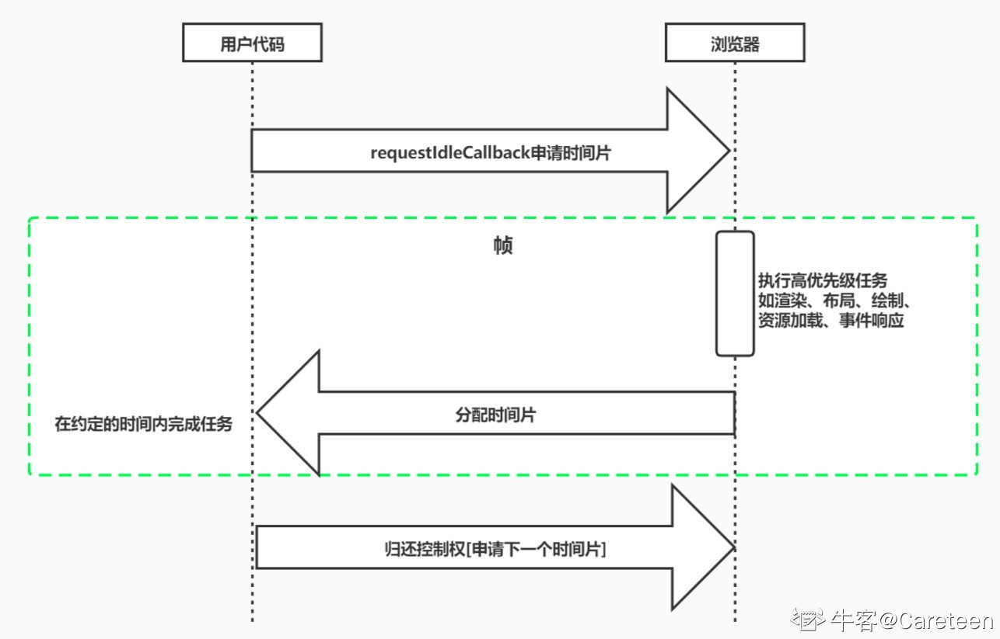
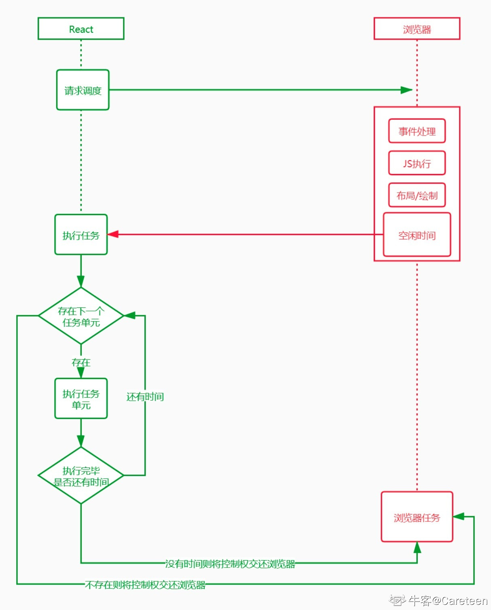
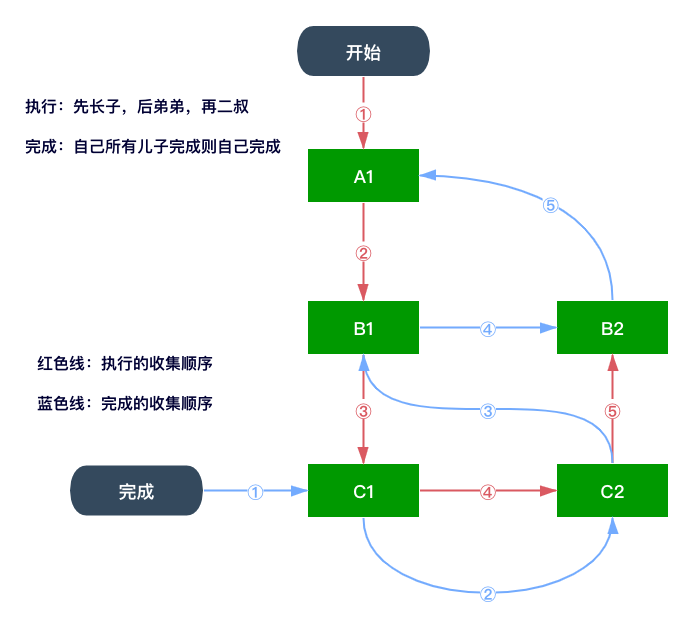

## Fiber 学习基础

### 屏幕刷新率

1，目前大多数设备的屏幕刷新率为：60 次 / 秒。

2，浏览器渲染动画或页面的每一帧的速率也需要跟设备屏幕的刷新率保持一致。

3，页面是一帧一帧绘制出来的，当每秒绘制的帧数（FPS）达到 60 时，页面是流畅的，小于这个值时，用户会感觉到卡顿。

4，每个帧的预算时间是 16.66 毫秒（1 秒 / 60）。

5，1s 60 帧，所以每一帧分到的时间是 1000/60 = 16 ms。所以我们书写代码时力求不让一帧的工作量超过 16ms。

### 帧

1，每个帧的开头包括 `样式计算，布局和绘制`。

2，JavaScript 执行 JavaScript 引擎和页面渲染引擎在同一个渲染线程，GUI 渲染和 JavaScript 执行是互斥的。

3，如果某个任务执行时间过长，浏览器会推迟渲染。

4，一个时间帧中执行顺序及包含内容如下：

> **input events（输入事件）**：`阻塞输入事件（touch、wheel）`和 `非阻塞输入事件（click、keypress）` =>
> 
> **JavaScript**：`定时器（timers）` => 
> 
> **开始帧**：每一帧事件包括（`window resize、scroll、media query change`）=> 
> 
> **requestAnimationFrame**：`requestAnimationFrame Frame callbacks` =>
> 
> **Layout（布局）**：`Recalculate style（计算样式）`、`Update Layout（更新布局）` =>
> 
> **Paint（绘制）**：`Compositing update`、`Paint invaidation`、`Record` =>
> 
> **空闲阶段**：`idle callback1`、`idle callback2`......
>
> 每一帧执行时间大概是：`16.6ms`。

### requestAnimationFrame

1，requestAnimationFrame 回调函数会在绘制之前执行。

```html
<body>
  <div class="box1" id="progress-bar"></div>
  <button id="btn">开始</button>
  <script>
    let btn = document.getElementById('btn');
    let oDiv = document.getElementById('progress-bar');
    let start;

    function progress() {
      oDiv.style.width = oDiv.offsetWidth + 1 + 'px';
      oDiv.innerHTML = (oDiv.offsetWidth) + '%';
      if (oDiv.offsetWidth < 100) {
        let current = Date.now();
        // 打印出开始准备执行的时候到真正执行时的时间差
        console.log(current - start);
        start = current;
        requestAnimationFrame(progress);
      }
    }

    btn.addEventListener('click', () => {
      // 每次点击之前先清除原来的宽度
      oDiv.style.width = 0;
      let current = Date.now();
      start = current;
      requestAnimationFrame(progress);
    })
  </script>
</body>
```

### requestIdleCallback

1，当希望快速响应用户，让用户觉得够快，不能阻塞用户交互，此时 `requestIdleCallback`  就能派上用场。

2，requestIdleCallback 使开发者能够`在主事件循环上执行后台和低优先级工作`，而不会影响延迟关键事件，如`动画`和`输入响应`。

3，正常帧任务完成后没超过 16ms，说明时间有富余，此时就会执行 requestIdleCallback 里注册的任务。



4，requestIdleCallback() 使用示例如下：

```html
<body>
  <div>
    <p id="p1">任务1:</p>
    <p id="p2">任务2:</p>
    <p id="p3">任务3:</p>
  </div>
  <script>
    /**
     * window.requestIdleCallback(callback, { timeout: 1000 });
     * 这是一个全局属性（挂载在 window 上），用于用户告知浏览器，用户现在执行的 callback 函数，它的优先级比较低，
     * 此时就需要通过 requestIdleCallback() 来告知浏览器，可以在空闲的时候执行 callback 函数。
     * 但是如果设置了 timeout 超时时间，那么就不管浏览器是否是空闲的都必须执行 callback 函数。
     */

    const p1 = document.getElementById('p1');
    const p2 = document.getElementById('p2');
    const p3 = document.getElementById('p3');

    function sleep(delay) {
      /**
       * 在 JS 里实现睡眠功能：
       * 如果 Date.now() - start 小于等于 delay 则什么都不做，即不会跳出 for 循环，该函数执行就不会结束。
       * 如果 Date.now() - start 大于 delay，则会跳出 for 循环，该函数也就执行结束了，会继续依次执行下面的代码。
       */
      for (var start = Date.now(); Date.now() - start <= delay;) {}
    }

    const works = [
      () => {
        console.log('第一个任务开始执行');
        p1.innerHTML = '第1个任务开始执行';
        sleep(20);
        console.log('第一个任务执行完成')
        p1.innerHTML = '第1个任务执行完成';
      },
      () => {
        console.log('第二个任务开始执行');
        p2.innerHTML = '第2个任务开始执行';
        sleep(20);
        console.log('第二个任务执行完成')
        p2.innerHTML = '第2个任务开始执行';
      },
      () => {
        console.log('第三个任务开始执行');
        p3.innerHTML = '第3个任务开始执行';
        sleep(20);
        console.log('第三个任务执行完成')
        p3.innerHTML = '第3个任务开始执行';
      },
    ]

    requestIdleCallback(workLoop, {
      timeout: 1000
    });

    /**
     * deadline 是一个对象，有两个属性：
     * - timeRemaining()：可以返回此帧还剩多少时间供用户使用。
     * - didTimeout：返回此 callback 任务是否超时。
     */
    function workLoop(deadline) {
      console.log(`本帧的剩余时间为${parseInt(deadline.timeRemaining())}`);
      // 如果此帧的剩余时间超过 0，或者已经超时了，且剩余任务数大于 0，则继续往下执行。
      // 如果没有剩余时间了，就需要放弃执行任务控制权，将控制权交还给浏览器
      while ((deadline.timeRemaining() > 0 || deadline.didTimeout) && works.length > 0) {
        performUnitOfWork();
      }

      // 如果还有任务没执行，则继续递归执行 requestIdleCallback()
      if (works.length > 0) {
        requestIdleCallback(workLoop, {
          timeout: 1000
        });
      }
    }

    function performUnitOfWork() {
      works.shift()();
    }
  </script>
</body>
```

### 单链表

1，单链表是一种链式存取的数据结构。

2，链表的数据是以节点来表示的，每个节点的构成为：`元素 + 指针（指向后继元素存储位置）`，元素就是存储数据的存储单元，指针就是连接每个节点的地址。

3，单链表的实现：

```html
<body>
  <div>singleLinkList</div>
  <script>
    class Update {
      // payload：数据或者说是元素
      constructor(payload, nextUpdate) {
        this.payload = payload;
        // nextUpdate：指向下一节点的指针
        this.nextUpdate = nextUpdate;
      }
    }

    const update = new Update({
      name: 'aaa'
    })
    console.log(update); // {payload: {name: 'aaa'}, nextUpdate: undefined}

    // 将数据串联起来形成链表结构
    class UpdateQueue {
      constructor() {
        // 原状态
        this.baseState = null;
        // 第一个更新
        this.firstUpdate = null;
        // 最后一个更新
        this.lastUpdate = null;
      }

      enqueueUpdate(update) {
        console.log(update); // { payload: { name: 'dnhyxc' }, nextUpdate: undefined }...
        if (this.firstUpdate == null) {
          this.firstUpdate = this.lastUpdate = update;
        } else {
          this.lastUpdate.nextUpdate = update;
          this.lastUpdate = update;
        }
      }

      // 获取老状态，然后遍历这个链表，进行更新
      forceUpdate() {
        // 初始状态
        let currentState = this.baseState || {};
        // 当前更新
        let currentUpdate = this.firstUpdate;
        while (currentUpdate) {
          let nextState = typeof currentUpdate.payload === 'function' ?
            currentUpdate.payload(currentState) :
            currentUpdate.payload;
          // 使用新状态替换老的状态
          currentState = {
            ...currentState,
            ...nextState
          };
          // 找下一个节点
          currentUpdate = currentUpdate.nextUpdate;
        }
        // 更新完成之后将链表清空
        this.firstUpdate = this.lastUpdate = null;
        this.baseState = currentState;
        // 将最新的状态返回
        return currentState;
      }
    }

    // 以实现一个计数器为例：{number: 0}  setState({number: 1}) setState((state) => ({number: state.number + 1}))
    let queue = new UpdateQueue();
    queue.enqueueUpdate(new Update({
      name: 'dnhyxc'
    }));
    queue.enqueueUpdate(new Update({
      number: 0
    }));
    queue.enqueueUpdate(new Update(state => ({
      number: state.number + 1
    })));
    queue.enqueueUpdate(new Update(state => ({
      number: state.number + 1
    })));
    const res = queue.forceUpdate();
    console.log(res); // { name: 'dnhyxc', number: 2 }
    console.log(queue.baseState); // { name: 'dnhyxc', number: 2 }
  </script>
</body>
```

## Fiber 历史

### Fiber 之间的协调

1，React 会递归比对 VirtualDOM 树，找出需要变动的节点，然后同步更新它们，这个过程 React 称为 Reconcilation(协调)。

2，在 Reconcilation 期间，React 会一直占用着浏览器资源，一则会导致用户触发的事件得不到响应，二则导致掉帧，用户可能会感觉到卡顿。

3，fiber 之前遍历 VDOM 的方式：

```js
/**
 * fiber 之前是什么样的，为什么需要 fiber？
 *  - 因为 fiber 之前是使用的 递归调用，而递归调用不能中断。
 *  - 执行栈越来越深，会影响性能，造成卡顿等不良影响。
 * 以下代码这种遍历是递归调用，执行栈会越来越深，而且不能中断，因为中断后再想恢复就非常难了
 */

let root = {
  key: 'A1',
  children: [
    {
      key: 'B1',
      children: [
        { key: 'C1', children: [] },
        { key: 'C2', children: [] }
      ]
    },
    {
      key: 'B2',
      children: []
    }
  ]
}

function walk(vdom) {
  doWork(vdom);
  vdom.children.forEach((child) => {
    walk(child);
  })
}

function doWork(vdom) {
  console.log(vdom.key);  // A1 => B1 => C1 => C2 => B2
}

walk(root);
```

### Fiber 是什么

1，我们可以通过某些调度策略合理分配 CPU 资源，从而提高用户的响应速度。

2，通过 Fiber 架构，让自己的 Reconcilation 过程变成可中断，适时的让出 CPU 执行权，除了可以让浏览器及时地响应用户的交互。

### Fiber 是一个执行单元

1，Fiber 是一个执行单元，每次执行完一个执行单元，React 就会检查现在还剩多少时间，如果没有时间就将控制权让出去。

2，Fiber 执行过程图如下：



### Fiber 是一种数据结构

1，React 目前的做法是使用链表，每个 VirtualDOM 节点内部表示为一个 Fiber。


```js
type Fiber = {
  // 类型
  type: any;
  // 父节点
  return: Fiber,
  // 指向第一个子节点
  child: Fiber,
  // 指向下一个弟弟
  sibling: Fiber
}
```

### Fiber 执行阶段

1，每次渲染有两个阶段：Reconciliation（协调 / render 阶段）和 Commit（提交阶段）。

2，协调阶段：可以认为是 Diff 阶段，这个阶段可以被中断，这个阶段会找出所有节点变更，例如节点新增、删除、属性变更等等，这些变更 React 称之为副作用（Effect）。

3，提交阶段：将上一个阶段计算出来的需要处理的副作用（Effect）一次性执行了，`这个阶段必须同步执行，不能被打断`。

### render 阶段

1，render 阶段会构建 fiber 树。

### element.js

1，构建节点：

```js
let A1 = { type: 'div', key: 'A1' }
let B1 = { type: 'div', key: 'B1', return: A1 }
let B2 = { type: 'div', key: 'B2', return: A1 }
let C1 = { type: 'div', key: 'C1', return: B1 }
let C2 = { type: 'div', key: 'C2', return: B1 }

A1.child = B1;
B1.sibling = B2;
B1.child = C1;
C1.sibling = C2;

module.exports = A1;
```

### render.js

1，遍历时先从顶点开始遍历。

2，如果有第一个儿子，先遍历第一个儿子。

3，如果没有第一个儿子，标志着此节点遍历完成。

4，如果有弟弟则遍历弟弟。

5，如果没有下一个弟弟，返回父节点，表示完成父节点遍历，如果有叔叔则先遍历叔叔，在返回父节点。

6，没有父节点则遍历结束。


